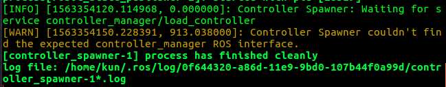
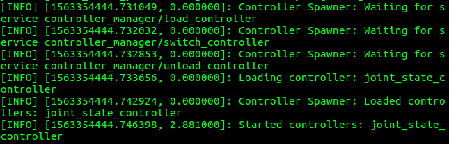
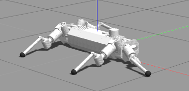
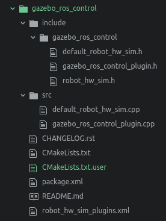
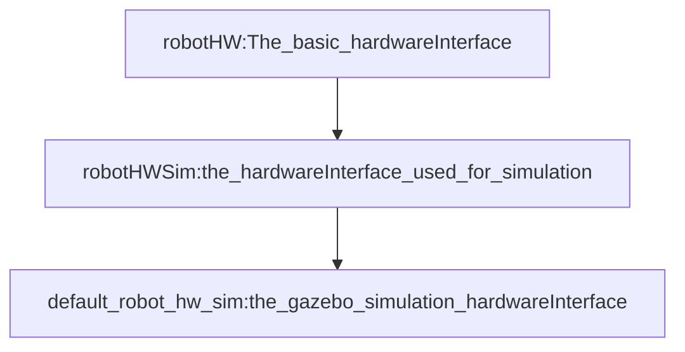

# gazebo_ros_learning
Tips: This file is to upload the basic controller on the quadruped model.

1. The namespace of the controller should be attentioned.
   In the simpledog_control.launch file

```cpp
   <node name="controller_spawner" pkg="controller_manager" type="spawner" respawn="false"
 	output="screen" ns="/simpledog" args="joint_state_controller"/>
  ```
Which corresponds to the controller load yaml file: simpledog_control.yaml

```cpp
  simpledog:
    # Publish all joint states -----------------------------------
    joint_state_controller:
      type: joint_state_controller/JointStateController
      publish_rate: 50
  ```
  And the gazebo tag in the urdf.xacro file
```cpp
  <gazebo>
    <plugin name="gazebo_ros_control" filename="libgazebo_ros_control.so">
      <robotSimType>gazebo_ros_control/DefaultRobotHWSim</robotSimType>
      <robotNamespace>/simpledog</robotNamespace>
      <legacyModeNS>true</legacyModeNS>
    </plugin>
  </gazebo>
  ```
  Otherwise,it will causes the following error:
  
  And the following picture shows the correct running:
  
2.Send the control command, using the following code:
```c++
rostopic pub -1 /simpledog/joint1_position_controller/command std_msgs/Float64 "data: 2.5"
```
You will get the following response:


_**Attention**_: In the yaml file,when you set the PID, you have a space between the P: and the _P number_: P:(SPACE)100
3. In the file:gazebo_sim.cpp, Which is the hardwareInterface of the robot. In the line 133, we initialized the jointangle, jointvelocity,etc. We can change these number here and the model in gazebo also change to the corresponding value.

4. In the package: gazebo_ros_control, it is enough for you to write the hardwareInterface of the robot if you have set the right transmission tag in urdf file. Also, another question is how the gazebo_ros_control can read the correct the transmission tag?
the answer is: If you open the package gazebo_ros_control, there are three files:

named: default_robot_hw_sim.h, which is inherited from the robotHWSim of file robot_hw_sim.h. robotHWSim inherits the robotHW.

So we change the values in DefaultRobotHWSim, we can change the model's angle in gazebo.
In the final line of default_robot_hw_sim.cpp
```C++
PLUGINLIB_EXPORT_CLASS(gazebo_ros_control::DefaultRobotHWSim, gazebo_ros_control::RobotHWSim)
```
Meaning it will export a pluglib(namespcae::classname,namespace::baseclass)
Also you should write another file: robot_hw_sim_plugins.xml like this:
```
<library path="lib/libgazebo_sim">

  <class
    name="gazebo_sim"
    type="gazebo_ros_control::MyRobotHWSim"
    base_class_type="gazebo_ros_control::RobotHWSim">
    <description>
      A default robot simulation interface which constructs joint handles from an SDF/URDF.
    </description>
  </class>
</library>
```
In the package.xml:
```
<export>
    <gazebo_ros_control plugin="${prefix}/robot_hw_sim_plugins.xml"/>
</export>
```
It must the gazebo_ros_control, corresponding the namespace of your class.
In the urdf file you uses in gazebo:
```
<gazebo>
  <plugin name="gazebo_ros_control" filename="libgazebo_ros_control.so">
    <robotSimType>gazebo_sim</robotSimType>
    <robotNamespace>/simpledog</robotNamespace>
    <legacyModeNS>true</legacyModeNS>
  </plugin>
</gazebo>
```
So the gazebo_sim will link the hardwareinterface with the this urdf.

4. The robot_state_interface(handle) should also be registered in gazebosim.cpp
